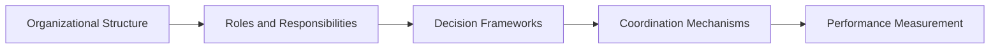

# Enterprise Operating Model

## Framework Context

This repository is part of the **Transformation Operating Framework** ecosystem.

Master framework repository:  
https://github.com/somerwalker/transformation-operating-framework

## About Enterprise Operating Model

A practical framework for designing organizational structures that enable strategy execution.

Organizations often struggle to execute strategy because their operating models do not support coordinated decision-making, cross-team collaboration, or accountability for outcomes.

The **Enterprise Operating Model** describes how organizations structure roles, decision authority, communication rhythms, and performance measurement systems to support large initiatives.

This repository is part of the **Transformation Operating System** framework.

Architecture overview:  
https://github.com/somerwalker/transformation-operating-system

---

## Why Operating Models Matter

Organizations frequently focus on strategy without designing the operating structures needed to execute that strategy.

Common challenges include:

- unclear decision authority
- fragmented ownership across teams
- slow cross-functional coordination
- inconsistent performance measurement
- misalignment between leadership priorities and delivery teams

A well-designed operating model creates the structures required for organizations to execute strategy effectively.

---

## Operating Model Components

These components together define how an organization functions day-to-day.

---

## Repository Contents

### Documentation

| File | Description |
|-----|-------------|
| docs/01-operating-model-overview.md | Overview of enterprise operating models |
| docs/02-structure-and-roles.md | Organizational structures and role design |
| docs/03-decision-frameworks.md | Decision authority and governance models |
| docs/04-cross-team-coordination.md | Structures for cross-functional collaboration |
| docs/05-performance-management.md | Measuring outcomes and organizational effectiveness |

---

### Templates

| File | Description |
|-----|-------------|
| templates/operating-model-canvas.md | Framework for designing operating models |
| templates/role-responsibility-matrix.md | Role ownership and accountability structure |
| templates/decision-rights-framework.md | Tool for defining decision authority |

---

### Examples

| File | Description |
|-----|-------------|
| examples/example-operating-model.md | Example enterprise operating model structure |

---

## Relationship to the Transformation Operating System

The Enterprise Operating Model supports the **organizational foundation** of the Transformation Operating System:

Strategy  
↓  
Operating Model  
↓  
Governance  
↓  
Transformation  
↓  
Execution  
↓  
Delivery  

---

## Framework Context

This repository is a supporting component of the **Transformation Operating Framework**, a layered model for aligning strategy, governance, transformation initiatives, and execution across complex organizations.

Transformation Operating Framework  
https://github.com/somerwalker/transformation-operating-framework

---

## Author

Somer Walker  
Enterprise Program Leader | Operational Excellence | AI Transformation

Background leading complex cloud, infrastructure, and AI initiatives across global organizations focused on turning strategy into disciplined execution.

LinkedIn  
https://www.linkedin.com/in/somerwalker

---

## Contributing

Suggestions, improvements, and additional examples are welcome.  
Please review `CONTRIBUTING.md` before submitting a pull request.

---

## Copyright

Copyright © 2026 Somer Walker

This repository documents components of the **Transformation Operating Framework**.  
Use of the framework methodology in commercial consulting or derivative consulting frameworks requires written permission from the author.
